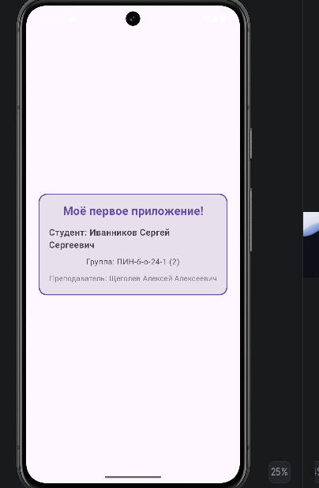

<div align="center">

# Hello Compose
### Программирование мобильных устройств · Лабораторная работа №1

Первое Android-приложение на Kotlin и Jetpack Compose.
Карточка студента · Material 3 · Декларативный интерфейс

[Результат](#preview) · [Паспорт работы](#passport) · [Запуск](#run) · [Отчёт](REPORT.md)

</div>

---

<a id="passport"></a>
## Программирование мобильных устройств — паспорт работы

| Поле | Значение |
|:---|:---|
| Университет | Северо-Кавказский федеральный университет |
| Дисциплина | Программирование мобильных устройств |
| Работа | №1 — установка среды разработки и запуск первого мобильного приложения на Jetpack Compose |
| Студент | Иванников Сергей Сергеевич |
| Группа | ПИН-б-о-24-1 |
| Подгруппа | 2 |
| Преподаватель | Щеголев Алексей Алексеевич |
| Дата | 06.10.2026 |
| Репозиторий | [akkariq/android-compose-hello](https://github.com/akkariq/android-compose-hello) |

<a id="preview"></a>
## Программирование мобильных устройств — результат

<div align="center">

</div>

> Скриншот показывает предыдущую версию экрана. В текущем коде заголовок заменён на «Моё первое приложение» по заданию. После запуска обновлённой версии нужно заменить `screenshots/img.png` новым снимком.

Экран содержит приветствие, ФИО студента, группу и ФИО преподавателя. Карточка оформлена рамкой, скруглёнными углами, тенью и цветами Material 3.

## Программирование мобильных устройств — реализация

| Элемент | Реализация |
|:---|:---|
| Точка входа | `MainActivity`, установка UI через `setContent` |
| Компонент экрана | `GreetingCard(studentName, group, teacher, modifier)` |
| Размещение | `Column`, центрирование по вертикали и горизонтали |
| Карточка | `Card`, `CardDefaults`, скругление 16 dp |
| Оформление | `padding`, `fillMaxSize`, `fillMaxWidth`, `clip`, `border` |
| Содержимое | `Text`, `Spacer`, размеры в `sp` и `dp` |
| Предпросмотр | `GreetingPreview` с `@Preview(showBackground = true)` |
| Документация | KDoc основного файла, README и отчёт |

Это статический учебный экран. База данных, сеть, навигация и интерактивные кнопки в текущем приложении не реализованы.

## Программирование мобильных устройств — стек

Версии взяты из конфигурации проекта.

| Компонент | Значение |
|:---|:---|
| Язык / Compose compiler plugin | Kotlin / 2.2.10 |
| Интерфейс | Jetpack Compose, Material 3 |
| Compose BOM | 2026.02.01 |
| Android Gradle Plugin | 9.2.1 |
| Gradle Wrapper | 9.4.1 |
| JVM toolchain | 21 |
| Минимальная версия Android | API 24 — Android 7.0 |
| Compile SDK | 36, minor API level 1 |
| Target SDK | 36 |
| Application ID | `ru.ivannikov.hello` |

<a id="run"></a>
## Программирование мобильных устройств — запуск

1. Клонируйте репозиторий:

```bash
git clone https://github.com/akkariq/android-compose-hello.git
cd android-compose-hello
```

2. Откройте корневую папку проекта в Android Studio.
3. Дождитесь синхронизации Gradle и установки SDK-компонентов согласно `app/build.gradle.kts`.
4. Используйте JVM toolchain 21, указанный в `gradle/gradle-daemon-jvm.properties`.
5. Выберите эмулятор или устройство с Android API 24 и выше.
6. Запустите конфигурацию `app` кнопкой Run.

### Сборка APK в Windows PowerShell

```powershell
.\gradlew.bat assembleDebug
```

### Сборка APK в Linux / macOS

```bash
chmod +x gradlew
./gradlew assembleDebug
```

После успешной сборки debug APK находится в `app/build/outputs/apk/debug/app-debug.apk`.

> Первая сборка требует доступа к репозиториям зависимостей. После последнего изменения заголовка сборка и запуск независимо не проверялись. Автоматическая проверка и CI пока не настроены.

## Программирование мобильных устройств — структура

```text
android-compose-hello/
├── app/
│   ├── build.gradle.kts
│   └── src/main/
│       ├── AndroidManifest.xml
│       ├── java/ru/ivannikov/hello/
│       │   ├── MainActivity.kt
│       │   └── ui/theme/
│       └── res/
├── gradle/
│   ├── libs.versions.toml
│   ├── gradle-daemon-jvm.properties
│   └── wrapper/
├── screenshots/
│   └── img.png
├── README.md
├── REPORT.md
├── build.gradle.kts
├── settings.gradle.kts
├── gradlew
└── gradlew.bat
```

## Программирование мобильных устройств — материалы

- [Исходный код экрана](app/src/main/java/ru/ivannikov/hello/MainActivity.kt)
- [Конфигурация Android-модуля](app/build.gradle.kts)
- [Каталог версий зависимостей](gradle/libs.versions.toml)
- [Отчёт: этапы, контрольные вопросы и вывод](REPORT.md)

---

Учебный проект Иванникова Сергея Сергеевича · ПИН-б-о-24-1 · 2026
